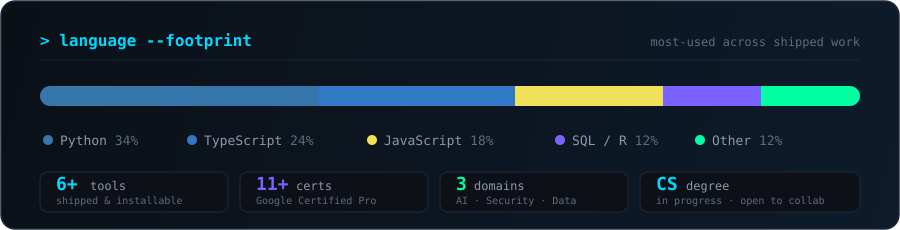

<!-- ══════════════════ HERO ══════════════════ -->

<div align="center">
  
</div>

<div align="center">
  <a href="https://amarjaleel.me"></a>
  <a href="https://www.linkedin.com/in/amarjaleel/"></a>
  <a href="https://twitter.com/ajbanbhan"></a>
  <a href="mailto:banbhanamarjalil@gmail.com"></a>
  <a href="https://instagram.com/amarjaleel_"></a>
  <a href="https://wa.me/923444432197"></a>
</div>

<br/>

<div align="center">
  
</div>

<br/>

<!-- ══════════════════ MISSION ══════════════════ -->

<table>
<tr>
<td width="60%" valign="top">

### `> whoami --verbose`

**AI Product Engineer** building at the intersection of **AI/ML**, **Cybersecurity**, and **Data Analytics** — pursuing a CS degree while shipping production tools: CLI packages on npm, VS Code extensions, AI voice agents, and full-stack web apps.

My obsession: **the security layer of the AI era** — supply-chain integrity, prompt injection, and making LLM tooling safe to trust.

```yaml
focus:      [AI/ML Applications, Security Architecture, Data-Driven Insights]
exploring:  [Advanced ML Algorithms, Cloud Security, Big Data Analytics]
certified:  Google Certified Professional · 11+ certifications
open_to:    [Collaboration, Open Source, Research Initiatives]
```

</td>
<td width="40%" valign="top">

### `> stats --live`

<!--
  RELIABILITY NOTE — this stats card is SELF-HOSTED to permanently avoid the
  "Invalid upstream response (402)" errors from the shared public instance.
  Instance: github-readme-stats-phi-orcin-87.vercel.app (own Vercel + PAT_1).
  To rotate/redeploy: update the domain in the  below.
-->


</td>
</tr>
</table>

<!-- ══════════════════ STACK ══════════════════ -->

## ⚡ Stack

<div align="center">
  
</div>

<div align="center">
  <br/>
  
  
  
  
</div>

<!-- ══════════════════ PROJECTS ══════════════════ -->

## 🛰️ Featured Builds

<div align="center">

| | Project | The Pitch | Arsenal |
|:---:|---|---|---|
| 🛡️ | **[VeriPatch](https://github.com/amarjaleelbanbhan/VeriPatch)** | npm security CLI — verifies package integrity **before** install; catches tampered packages & supply-chain attacks |   |
| 🔍 | **[MCTS](https://github.com/amarjaleelbanbhan/MCTS)** | MCP Security Scanner — static analysis of AI tool definitions for prompt injection, data exfiltration & code-exec risks |   |
| ✅ | **[TODO Tracker Pro](https://github.com/amarjaleelbanbhan/todo-tracker-pro)** | VS Code extension — every TODO/FIXME/HACK in one sidebar, with Gemini AI priority triage |   |
| 🏗️ | **[BuildSphere](https://github.com/amarjaleelbanbhan/BuildSphere)** | Browser-based 3D floor planner — walls, furniture, undo/redo, export. Pure WebGL |   |
| 🩺 | **[MediTalk AI](https://github.com/amarjaleelbanbhan/MediTalk_AI_Agent)** | Voice agent for preliminary medical consultation — 85% symptom-analysis accuracy, natural speech |   |
| 🤲 | **[ZakatLink](https://github.com/amarjaleelbanbhan/ZakatLink)** | Full-stack Zakat platform — donors ↔ recipients, role-based auth, beneficiary tracking |   |

</div>

<!-- ══════════════════ SNAKE ══════════════════ -->

<div align="center">
  <picture>
    <source media="(prefers-color-scheme: dark)" srcset="https://raw.githubusercontent.com/amarjaleelbanbhan/amarjaleelbanbhan/output/snake-dark.svg"/>
    
  </picture>
</div>

<!-- ══════════════════ ACTIVITY ══════════════════ -->

## 📡 Signal

<div align="center">
  
</div>

<div align="center">
  
</div>

<!-- ══════════════════ NOW ══════════════════ -->

## 🧭 Currently

```diff
+ Building a comprehensive AI/ML portfolio
+ Contributing to open-source AI/LLM security tooling
+ Developing data analytics dashboards for real operational datasets
! Deep-diving supply-chain & prompt-injection threat research
```

<sub>🧠 Complex problems → AI + data · 🔍 Security research rabbit holes · 📈 Data storytelling · 🌱 Growth mindset · 🎮 Framework explorer</sub>


<!-- ══════════════════ CONNECT ══════════════════ -->

## 🤝 Let's Build Something

Open to **collaborations**, **open-source work**, **research initiatives**, and **new opportunities**. If you're working on AI security, developer tooling, or data products — my inbox is open.

<div align="center">
  <a href="https://www.linkedin.com/in/amarjaleel/"></a>
  &nbsp;
  <a href="mailto:banbhanamarjalil@gmail.com"></a>
  &nbsp;
  <a href="https://wa.me/923444432197"></a>
</div>

<br/>

<div align="center">
  
  <br/><br/>
  <sub> ⭐ If something here caught your eye, a star goes a long way.</sub>
</div>


